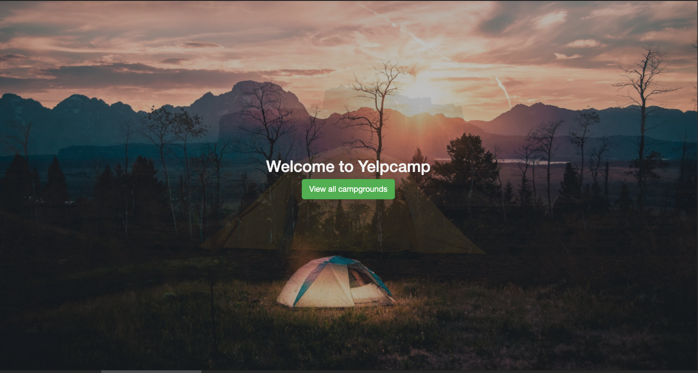
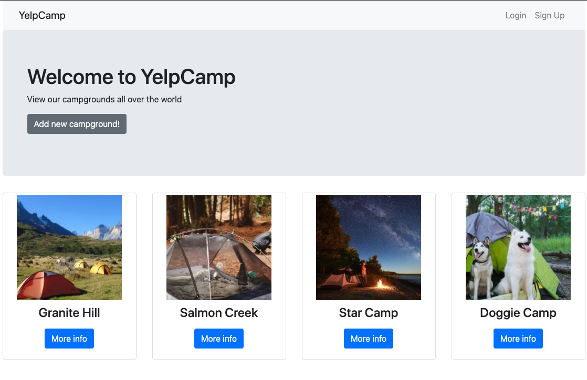
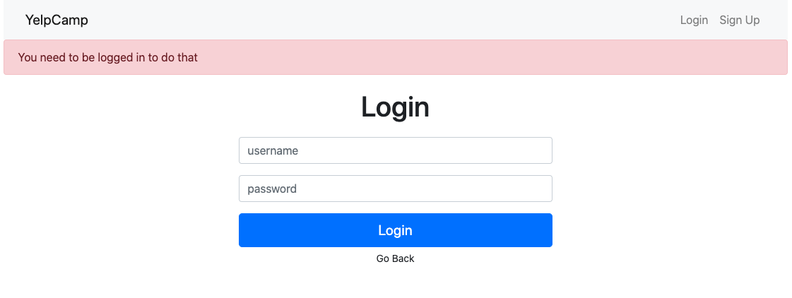
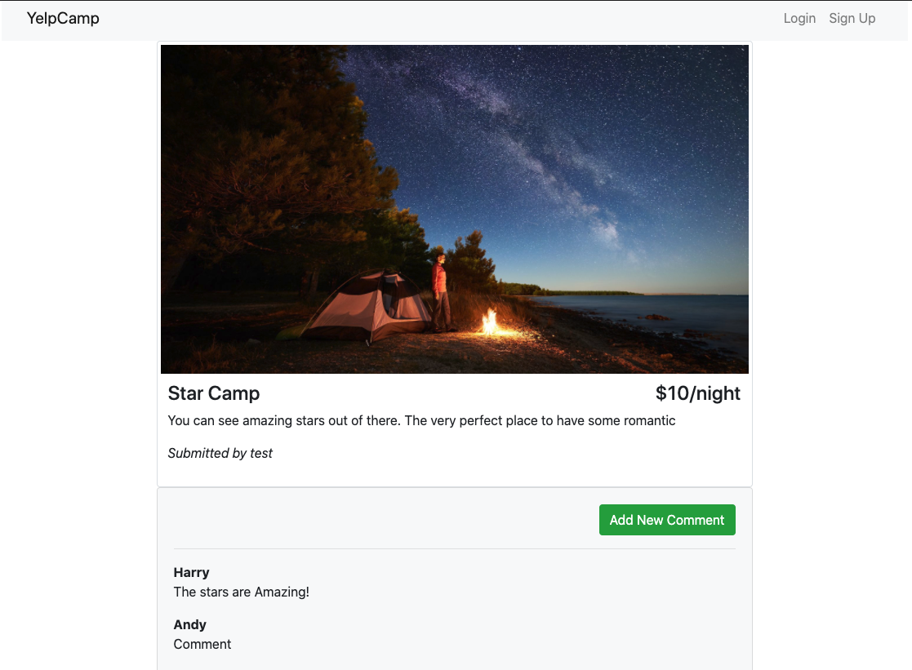
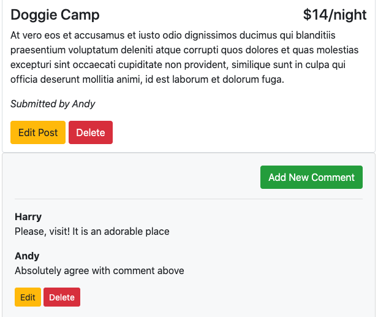
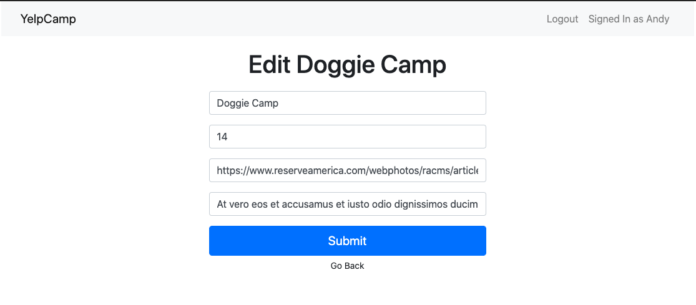

# Posting Website

Website built using nodeJS. Integrates with a server and enables users to check, post and comment the camps postings. App communicates with mongoDB and illustrates the up-to date information.

## To launch

Change the directory in Terminal for one with a project files. Then run following command to enable the port

`node app.js`

after, go to the `localhost:3300` in your browser to see the landing page.
It has the animation done using css. Every 10 seconds the background picture will be changed with slight transition.

The "View all campgrounds' button will transfer user to the main page iwth the listing of camps preview. The layout is built using Embedded JavaScript and Bootstrap.

## **Campgrounds listing**

The buttons on the navbar on this page depends on the fact whether the user is logged in. If not, "Login" and "Sign Up" buttons appear. and when the user has already entered their credentials correctly, these buttons will be replaced with "Log out" and "Signed in as `<%username%>`"

 

 

User is able to either add new campground or view present ones. The "Add New Campground button" is protected from unlogged users by middleware function `isLoggedIn`. It transfers them to the login page with a relevant error.

 

"More info" button communicates with database and retrieves the info on the selected post. So it is shown on the next page. Along with the post details, user is able to see comments and to leave one if the session is logged in. In addition to that the user is able to edit own comments and posts.
 

This is a page which not logged in user sees: 

And if user is logged and wisited own post, the description and comment parts will look like following:

Edit function transfer to the create comment/post page and fills the inputs with existing data. The comments/posts are updated upon the click action on a Submit button.

Edit Doggie Camp post:

The logout button ends the session for the user.
